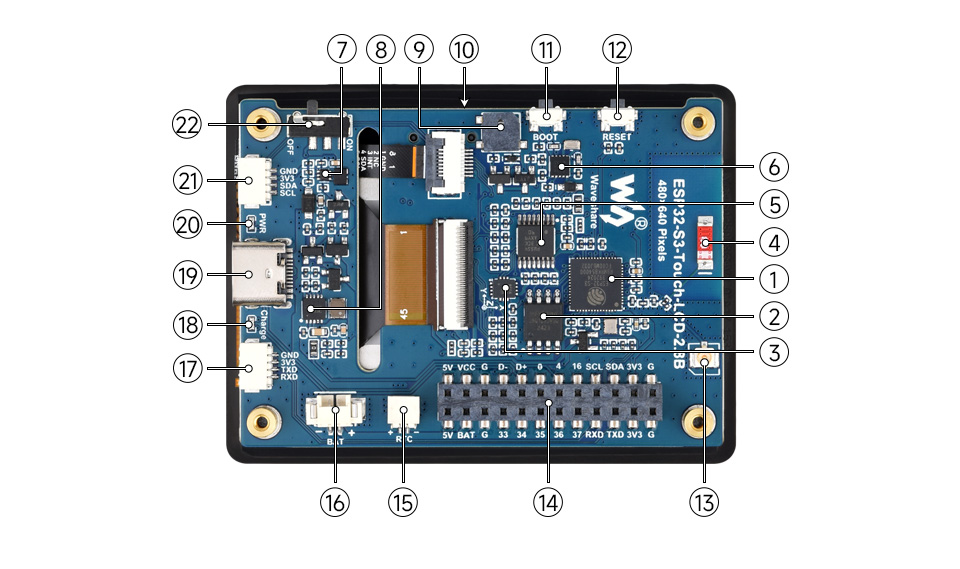

# ESP32-S3 Touch LCD 2.8B - Professional Starter Kit

[](https://github.com/espressif/esp-idf)
[](LICENSE)
[](https://github.com)

A **production-ready**, modular starter kit for the [Waveshare ESP32-S3-Touch-LCD-2.8B](https://www.waveshare.com/wiki/ESP32-S3-Touch-LCD-2.8B) development board. Features clean code architecture, comprehensive peripheral drivers, and multiple demo applications.



---

## ✨ Features

### Hardware Support
- ✅ **2.8" IPS LCD** (480x640, ST7701 + RGB565, 30MHz pixel clock)
- ✅ **GT911 Capacitive Touch** (5-point multi-touch, I2C)
- ✅ **QMI8658 6-Axis IMU** (3-axis accelerometer + 3-axis gyroscope)
- ✅ **PCF85063 RTC** with battery backup
- ✅ **SD Card** (FAT32, high-performance 16KB clusters)
- ✅ **Power Management** (4 power modes, auto-sleep, battery monitoring)
- ✅ **TCA9554 I/O Expander** (GPIO extension)
- ✅ **LVGL v9.4** GUI integration

### Code Quality
- 🏆 **Zero compiler warnings** (GCC 14.2)
- 📐 **SonarQube compliant** (no magic numbers, named constants)
- 📚 **Comprehensive documentation** (header comments, inline docs)
- 🧩 **Modular architecture** (independent components)
- 🔒 **Type-safe** (constexpr constants, namespaces)
- ⚡ **Optimized** (DMA, bounce buffers, PSRAM management)

---

## 🚀 Quick Start

### Prerequisites
- [ESP-IDF v5.5+](https://docs.espressif.com/projects/esp-idf/en/latest/esp32s3/get-started/)
- ESP32-S3-Touch-LCD-2.8B development board
- USB-C cable

### Build & Flash

```bash
# Clone repository
git clone <your-repo-url>
cd version1

# Set up ESP-IDF environment
. $HOME/esp-idf-v5.5.1/export.sh

# Build
idf.py build

# Flash and monitor
idf.py flash monitor
```

### Select Demo

Edit `main/main.cpp`:

```cpp
enum class DemoMode {
    CORNER_SQUARES,      // LCD coordinate test
    TOUCH_DRAWING,       // Touch input test
    IMU_VISUALIZATION,   // 3D cube with motion
    RTC_CLOCK,           // Real-time clock
    SD_CARD_DEMO,        // File operations
    POWER_MGMT_TEST,     // Power management
    DEFAULT_UI,          // LVGL counter
};

constexpr DemoMode ACTIVE_MODE = DemoMode::POWER_MGMT_TEST;
```

---

## 📦 Project Structure

```
version1/
├── components/
│   ├── board_drivers/          # Hardware abstraction layer
│   │   ├── include/
│   │   │   ├── board_config.hpp        # Pin definitions
│   │   │   ├── board_constants.hpp     # Hardware timing constants
│   │   │   ├── board_drivers.hpp       # Driver API
│   │   │   ├── gt911_simple.hpp        # Touch controller
│   │   │   └── lcd_st7701_rgb.hpp      # LCD driver
│   │   └── src/
│   │       ├── board_drivers.cpp    # Initialization
│   │       ├── gt911_simple.cpp        # Touch implementation
│   │       └── lcd_st7701_rgb.cpp      # LCD implementation
│   │
│   ├── power_manager/          # Power & battery management
│   │   ├── include/
│   │   │   ├── power_manager.hpp       # API
│   │   │   └── power_constants.hpp     # Constants
│   │   └── power_manager.cpp
│   │
│   ├── sd_services/            # SD card file system
│   │   ├── include/
│   │   │   ├── sd_services.hpp         # API
│   │   │   └── sd_constants.hpp        # Constants
│   │   └── src/sd_services.cpp
│   │
│   ├── rtc_services/           # Real-time clock
│   │   ├── include/
│   │   │   ├── rtc_services.hpp        # API
│   │   │   └── rtc_constants.hpp       # Constants
│   │   └── src/rtc_services.cpp
│   │
│   ├── imu_services/           # Motion sensors
│   │   ├── include/
│   │   │   ├── imu_services.hpp        # API
│   │   │   └── imu_constants.hpp       # Sensor thresholds
│   │   └── src/
│   │       ├── pedometer.cpp           # Step counter
│   │       ├── motion_detection.cpp    # Shake/freefall
│   │       ├── screen_orientation.cpp  # Auto-rotation
│   │       └── gaming_control.cpp      # Tilt controls
│   │
│   └── lvgl_wrapper/           # LVGL integration
│       ├── include/lvgl_wrapper.hpp
│       └── lvgl_wrapper.cpp
│
├── main/
│   ├── main.cpp                # Entry point & demo selector
│   ├── test.cpp                # Demo implementations
│   ├── test.hpp                # Demo declarations
│   ├── test_constants.hpp      # Demo configuration
│   ├── ui.cpp                  # LVGL UI examples
│   └── ui.hpp                  # UI declarations
│
├── README.md                   # This file
├── STARTER_KIT_GUIDE.md        # Detailed API guide
└── sdkconfig                   # ESP-IDF configuration
```

---

## 🎮 Demo Applications

### 1. Corner Squares Test
**Purpose:** Verify LCD coordinate system and RGB timing

Visual test with 4 colored squares at screen corners.

### 2. Touch Drawing
**Purpose:** Test touch controller and multi-touch support

Interactive drawing application with real-time touch tracking.

### 3. IMU Visualization
**Purpose:** Demonstrate 3D rendering and motion sensing

Rotating 3D cube controlled by tilting the board. Includes:
- Real-time accelerometer/gyroscope data
- 3D projection and rendering
- Exponential smoothing filter

### 4. RTC Clock
**Purpose:** Real-time clock functionality

Digital clock with:
- Date/time display (PCF85063)
- Day of week calculation (Zeller's congruence)
- Uptime counter
- LVGL-based UI

### 5. SD Card Demo
**Purpose:** File system operations

Complete SD card demonstration:
- Mount/unmount
- File read/write
- Directory listing
- Card info (type, size, speed class)
- FAT32 format
- LVGL file browser

### 6. Power Management Test ⭐
**Purpose:** Production-ready power management

Comprehensive power control:
- **Power Modes:** ACTIVE (100% backlight), LOW_POWER (20% backlight), SLEEP (light sleep)
- **Auto-Sleep:** Configurable timeout (10s/20s/30s/OFF)
- **Touch Wake-Up:** Wake from sleep via touch interrupt
- **SD Card Integration:** Automatic unmount before sleep, remount after wake
- **Countdown Display:** Real-time sleep timer
- **Wake Reason:** Displays why device woke up

**Power Consumption:**
- ACTIVE: ~250-350mA
- LOW_POWER: ~50-100mA
- SLEEP: ~5-10mA (LCD off, touch interrupt active)

### 7. LVGL UI Demo
**Purpose:** LVGL integration example

Simple counter with buttons and status bar.

---

## 🔧 Component APIs

### Board Drivers

```cpp
#include "board_drivers.hpp"

// Initialize all hardware
BoardDrivers::HardwareHandles hw = {};
ESP_ERROR_CHECK(BoardDrivers::initAll(hw));

// Access hardware
hw.lcdHandle->rgbPanel    // LCD panel
hw.touch                  // Touch controller
hw.imu                    // IMU sensor
hw.rtc                    // RTC chip
hw.backlightChannel       // Backlight PWM
```

### Power Manager

```cpp
#include "power_manager.hpp"

PowerManager pm;
PowerManager::Config config = {
    .lcdPanel = hw.lcdHandle->rgbPanel,
    .touchHandle = nullptr,  // GT911 uses custom driver
    .backlightChannel = hw.backlightChannel,
    .touchIntPin = BoardConfig::TOUCH_INT_PIN,
    .autoSleepTimeoutSec = 20,
};
pm.init(config);

// Power modes
pm.setMode(PowerMode::ACTIVE);
pm.setMode(PowerMode::LOW_POWER);
pm.setMode(PowerMode::SLEEP);

// Auto-sleep
pm.setAutoSleepTimeout(30);  // 30 seconds
pm.resetAutoSleepTimer();     // Reset on user activity
```

### SD Services

```cpp
#include "sd_services.hpp"

// Initialize
ESP_ERROR_CHECK(sd_services::initSD());

// File operations
sd_services::writeFile("/sdcard/test.txt", "Hello World");
std::string content = sd_services::readFile("/sdcard/test.txt");

// Directory operations
std::vector<std::string> files = sd_services::listDir("/sdcard");

// Card info
sd_services::printCardInfo();

// Cleanup
sd_services::deinitSD();
```

### RTC Services

```cpp
#include "rtc_services.hpp"

// Set time
rtc_services::DateTime dt = {
    .year = 2025, .month = 1, .day = 15,
    .hour = 14, .minute = 30, .second = 0
};
rtc_services::setDateTime(dt);

// Get time
rtc_services::DateTime now = rtc_services::getDateTime();

// Format
std::string formatted = rtc_services::formatDateTime(now);
// Output: "2025-01-15 14:30:00"
```

### IMU Services

```cpp
#include "imu_services.hpp"

// Read raw data
ImuServices::SensorData data = ImuServices::readSensorData();
float accel_x = data.accelX;  // m/s²
float gyro_z = data.gyroZ;    // rad/s

// Motion detection
ImuServices::startShakeDetection([](){
    ESP_LOGI("IMU", "Shake detected!");
});

// Pedometer
ImuServices::startPedometer([](uint32_t steps){
    ESP_LOGI("IMU", "Steps: %lu", steps);
});
```

---

## 📐 Code Quality Standards

### Constants Organization

All magic numbers replaced with named constants:

```cpp
// components/power_manager/include/power_constants.hpp
namespace AutoSleepConfig {
    constexpr uint32_t CHECK_INTERVAL_MS = 1000;
    constexpr uint32_t WARNING_THRESHOLD_SEC = 10;
}

// Usage in code
vTaskDelay(pdMS_TO_TICKS(CHECK_INTERVAL_MS));
```

### Namespace Isolation

Each component uses its own namespace:

```cpp
namespace BoardDrivers { /* ... */ }
namespace sd_services { /* ... */ }
namespace ImuServices { /* ... */ }
```

### Documentation

All public APIs have Doxygen comments:

```cpp
/**
 * @brief Set power mode
 * @param mode Target power mode (ACTIVE, LOW_POWER, SLEEP, DEEP_SLEEP)
 * @return ESP_OK on success, error code otherwise
 */
esp_err_t setMode(PowerMode mode);
```

---

## 🔍 Hardware Specifications

| Component   | Specification                                    |
| ----------- | ------------------------------------------------ |
| **MCU**     | ESP32-S3R8 (Dual-core Xtensa LX7, 240MHz)        |
| **Memory**  | 512KB SRAM, 384KB ROM, 16MB Flash, 8MB PSRAM     |
| **Display** | 2.8" IPS LCD, 480x640, RGB565, 30MHz pixel clock |
| **Touch**   | GT911, I2C (0x5D), 5-point capacitive            |
| **IMU**     | QMI8658, I2C, ±16g accel, ±2048°/s gyro          |
| **RTC**     | PCF85063, I2C, battery backup                    |
| **SD Card** | FAT32, SDSC/SDHC/SDXC support                    |
| **Power**   | 5V USB-C, 3.7V LiPo battery (MX1.25)             |

### Pin Configuration

See [`board_config.hpp`](components/board_drivers/include/board_config.hpp) for complete pin mapping.

**Key Pins:**
- I2C: SCL=GPIO7, SDA=GPIO15
- LCD: 16-bit parallel RGB (GPIO 3-21, 38-48)
- Touch INT: GPIO16
- Backlight: GPIO6 (LEDC PWM)
- SD Card: 4-bit SDMMC

---

## 🛠️ Advanced Topics

### RGB Panel Timing

**Critical:** Do not modify these values without understanding ST7701 datasheet.

```cpp
.timings = {
    .pclk_hz = 30 * 1000 * 1000,  // 30MHz pixel clock
    .h_res = 480, .v_res = 640,
    .hsync_pulse_width = 8,
    .hsync_back_porch = 10,
    .hsync_front_porch = 50,
    .vsync_pulse_width = 2,
    .vsync_back_porch = 18,
    .vsync_front_porch = 8,
},
.bounce_buffer_size_px = 10 * 480,  // CRITICAL for PSRAM performance!
```

**Why bounce buffer matters:** PSRAM is slow. The bounce buffer (in SRAM) enables smooth DMA transfers, preventing screen tearing and coordinate issues.

### Battery Monitoring

LiPo voltage-to-percentage curve (configured in `power_constants.hpp`):

| Voltage | Percentage | State               |
| ------- | ---------- | ------------------- |
| 4.2V    | 100%       | Fully charged       |
| 3.7V    | 50%        | Nominal voltage     |
| 3.4V    | 10%        | Low battery warning |
| 3.0V    | 0%         | Cutoff voltage      |

---

## 🐛 Troubleshooting

### Build Issues

**Error:** `ESP-IDF version mismatch`
- **Solution:** Use ESP-IDF v5.5.1 or later

**Error:** `Component not found`
- **Solution:** Run `idf.py reconfigure`

### Runtime Issues

**Issue:** Touch not responding
- Check I2C address (should be 0x5D)
- Verify INT pin (GPIO16) is not in use
- Check reset sequence in `board_drivers.cpp`

**Issue:** Screen tearing or wrong colors
- Verify `bounce_buffer_size_px` is set (10*480)
- Check RGB channel order (RGB vs BGR)
- Confirm pixel format is RGB565

**Issue:** SD card not detected
- Ensure card is FAT32 formatted
- Check card is inserted correctly
- Try lower clock speed in `sd_services.cpp`

**Issue:** Sleep mode not working
- Verify touch INT pin is configured for wake-up
- Check SD card is unmounted before sleep
- Ensure auto-sleep timeout is set

---

## 📚 Resources

- **Hardware Wiki:** [Waveshare ESP32-S3-Touch-LCD-2.8B](https://www.waveshare.com/wiki/ESP32-S3-Touch-LCD-2.8B)
- **ESP-IDF Docs:** [Programming Guide](https://docs.espressif.com/projects/esp-idf/en/latest/esp32s3/)
- **LVGL Docs:** [LVGL v9.4](https://docs.lvgl.io/9.4/)
- **Datasheets:**
  - [ST7701 LCD Driver](https://www.displayfuture.com/Display/datasheet/controller/ST7701.pdf)
  - [GT911 Touch Controller](https://github.com/goodix/gt9xx)
  - [QMI8658 IMU](https://www.qstcorp.com/en_comp_prod/QMI8658)
  - [PCF85063 RTC](https://www.nxp.com/docs/en/data-sheet/PCF85063A.pdf)

---

## 🤝 Contributing

Contributions are welcome! Please:

1. Follow the existing code style
2. Maintain zero compiler warnings
3. Add constants for all magic numbers
4. Document all public APIs
5. Test on hardware before submitting

---

## 📄 License

This starter kit is provided as-is for educational and commercial use.

---

## 🙏 Acknowledgments

- **Espressif** - ESP-IDF framework
- **Waveshare** - Hardware design and documentation
- **LVGL** - GUI framework

---

**Made with ❤️ for embedded developers**

For detailed API documentation, see [STARTER_KIT_GUIDE.md](STARTER_KIT_GUIDE.md)
